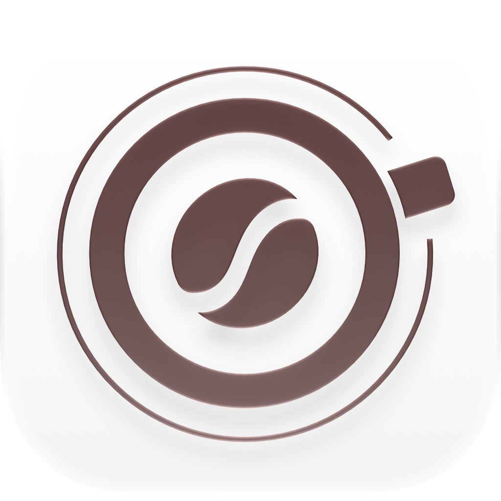

# Grano

  

  <strong>Café especial do seu jeito.</strong>

  Um aplicativo para organizar seus grãos, explorar diferentes preparos e acompanhar suas experiências com café especial.

---

## Sobre o projeto

O **Grano** é um aplicativo para quem gosta de café especial e quer ter mais controle sobre seus grãos e preparos.

A proposta é reunir, em um só lugar, o acompanhamento dos grãos disponíveis, diferentes métodos de preparo, proporções, timers personalizados e o registro dos cafés preparados.

## Funcionalidades

### Grãos

- Cadastro de grãos
- Registro de origem, torra e outras informações
- Controle da quantidade disponível
- Atualização do consumo conforme novos cafés são preparados

### Preparos

- Exploração de diferentes métodos de preparo
- Sugestões de proporção entre café e água
- Informações sobre os métodos
- Criação de preparos personalizados

### Timer

- Timer personalizado para cada preparo
- Etapas com tempos definidos
- Orientações durante cada etapa
- Acompanhamento do preparo em tempo real

### Cafés

- Registro dos cafés preparados
- Informações sobre cada experiência
- Histórico dos preparos
- Acompanhamento da evolução ao longo do tempo

---

## Tecnologias

- Swift
- SwiftUI
- SwiftData
- Xcode
- GitHub

---

## Projeto

O Grano foi desenvolvido durante a **Apple Developer Academy | UFPE**, em uma equipe multidisciplinar formada por:

- [Débora Lemos](https://github.com/deblemos)
- [João Vitor Moraes](https://github.com/joao-vmoraes)
- [Luísa Simões](https://github.com/luisamsimoes)
- [Clara Souza](https://github.com/Cla-Sou)

## Suporte e privacidade

Para dúvidas, problemas ou sugestões, acesse:

**[Suporte](suporte.html)**

Para consultar as informações sobre privacidade:

**[Política de Privacidade](privacidade.html)**

---

## Desenvolvido com café

**Grano**

Café especial, do seu jeito.
